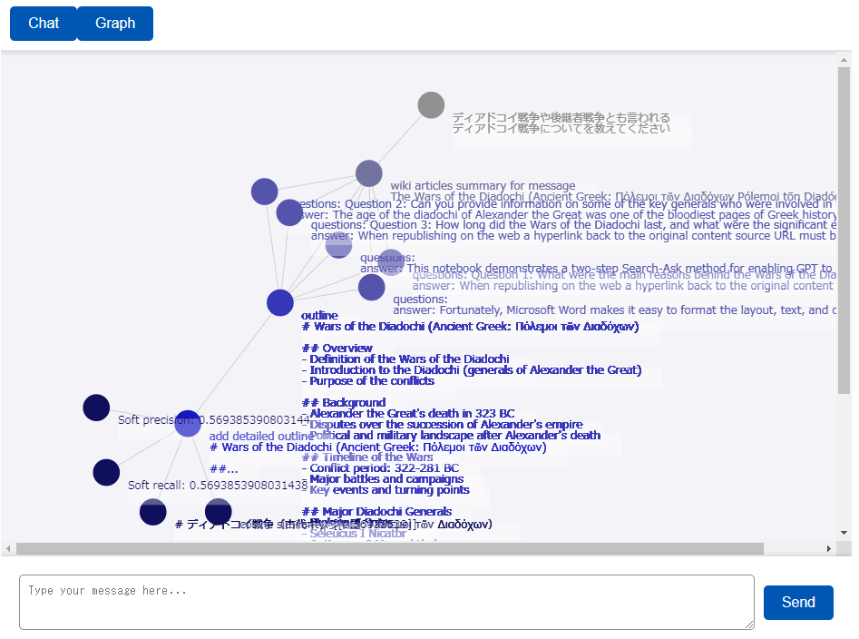
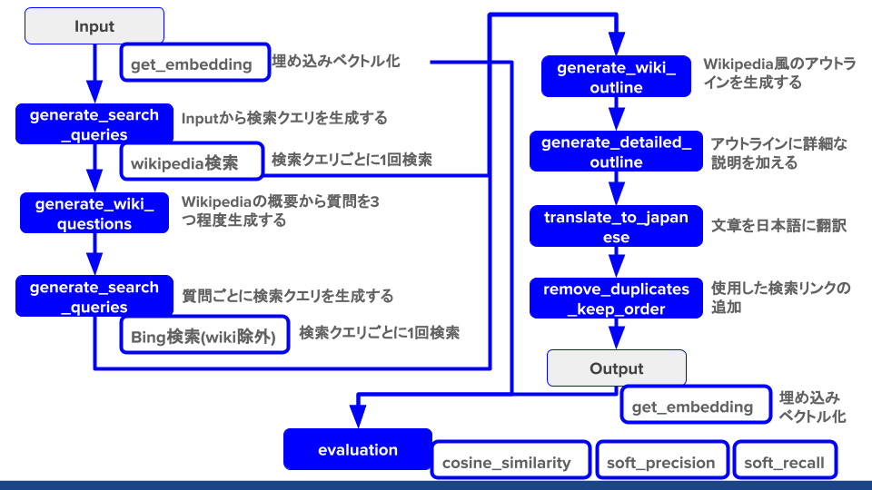

# WikiLikeSearchLLMAgent

WikiLikeSearchLLMAgentは、Wikipediaの記事風の調査報告書をWikipedia記事とBing検索、`gpt-3.5-turbo-0125`と`gpt-4o-2024-05-13`のLLMモデルを使用して作成するLLMエージェントです。


途中の出力結果は力学グラフで出力します。
評価として`text-embedding-3-small`を使用して入力内容と最終的な報告書の出力結果を埋め込みベクトル化して`cosine similarity`, `Soft Precision`, `Soft Recall`を算出しています


---

WikiLikeSearchLLMAgent is an LLM agent designed to create research reports in the style of Wikipedia articles, utilizing data from Wikipedia entries, Bing searches, and the `gpt-3.5-turbo-0125` and `gpt-4o-2024-05-13` LLM model.




The intermediate outputs are visualized using dynamic graphs. For evaluation, the project employs the `text-embedding-3-small` model to vectorize both the input data and the final report outputs, calculating metrics such as cosine similarity, Soft Precision, and Soft Recall to assess the quality and relevance of the generated content.

---

## 主な機能

- 応答の生成: app.py では、入力した調査報告書を作成したい内容について検索クエリを作成。その内容をWikipediaで検索し、概要を取得。概要から質問を3つ程度作成。
作成した質問に対して検索クエリを作り、Bing検索します。
Wikipediaの検索、Bing検索の結果を使用してWikipedia記事風のアウトラインを作成、アウトラインを説明するテキストを追加作成して日本語に翻訳したものを最終的な調査報告書として出力します。
- グラフによるインタラクションの可視化: 入力されたメッセージと最終的な出力以外の途中の生成結果は力学グラフで出力します。

## 参考内容

- [Graph Chain-of-Thought: Augmenting Large Language Models by Reasoning on Graphs](https://arxiv.org/abs/2404.07103)
- [Assisting in Writing Wikipedia-like Articles From Scratch with Large Language Models](https://arxiv.org/abs/2402.14207)
- [Soft precision and recall](https://www.sciencedirect.com/science/article/pii/S0167865523000296)

---

## Key Features

- Generating Responses: In app.py, a search query is crafted based on the input about the desired research report content. This content is searched on Wikipedia to gather summaries and from these summaries, about three questions are generated. These questions are then used to formulate search queries for Bing. Using the results from both Wikipedia and Bing searches, a Wikipedia-style article outline is created, and additional explanatory text is added. This content is then translated into Japanese to produce the final research report.
- Visualization of Interactions through Graphs: The intermediate outputs, apart from the initial input message and the final output, are visualized using dynamic graphs.

---

## Agent構成
## Agent Configuration



---

## 動作例
## Examples of Operation

```
Input: ディアドコイ戦争や後継者戦争とも言われるディアドコイ戦争について教えてください
```

- 1. generate_search_queries: Inputから検索クエリを生成する
```
検索クエリ: Diadochi Wars timeline
```

- 1.1 検索クエリに対して1回のwikipedia検索の実施

```
検索結果タイトル: Wars of the Diadochi
URL: https://en.wikipedia.org/wiki/Wars_of_the_Diadochi
```

- 2. generate_wiki_questions: Wikipediaの概要から質問を3つ程度生成する
- 3. generate_search_queries: 質問ごとに検索クエリを生成する
- 3-1. Bing検索(wiki除外): 検索クエリごとに3回全文検索を行い、結果から検索クエリとそれに関連する内容を要約する
```
questions: Question 1: What were the main reasons behind the Wars of the Diadochi, also known as the Wars of Alexander's Successors?
answer: 1. **Keywords: Alexander the Great's Death, Leadership Void**
   - *On June 10, 323 BCE, Alexander the Great died in Babylon, leaving his empire without clear leadership.*

2. **Keywords: Military Commanders, Territorial Conflict**
   - *Alexander's military commanders fought over territories, leading to the Wars of Succession or Wars of the Diadochi.*

3. **Keywords: Rivalry, Dynasties**
   - *Over three decades of intense rivalry ended with the establishment of three dynasties that lasted until Roman times.*

4. **Keywords: Alexander’s Exile Decree, Rebellion**
   - *Alexander’s proposed Exile Decree aimed at returning Greek exiles caused unrest, with many troops protesting and some satraps being executed for treason.*

5. **Keywords: Revolts, Lamian War**
   - *After Alexander's death, Athens and Aetolia revolted, leading to the Lamian War, which ended with intervention by Antipater and Craterus.*

6. **Keywords: Alexander’s Successor, Perdiccas**
   - *On his deathbed, Alexander handed his signet ring to Perdiccas, leading to debates over his final words and the choice of a successor.*

7. **Keywords: Succession Dispute, Arrhidaeus, Alexander IV**
   - *The succession struggle centered around Alexander's half-brother Arrhidaeus and his unborn son Alexander IV, with commanders divided over support.*

8. **Keywords: Perdiccas, Roxanne, Assassination**
   - *Perdiccas supported Roxanne and Alexander IV but faced betrayal, leading Roxanne to kill Alexander's other wife and her sister.*

9. **Keywords: Babylon Partition, Territorial Division**
   - *The Partition of Babylon divided Alexander's empire among key commanders, including Antipater, Craterus, Ptolemy, Lysimachus, Eumenes, and Antigonus.*

10. **Keywords: Successor Wars, Antigonus, Seleucus, Ptolemy**
    - *The Successor Wars involved major figures like Antigonus, Seleucus, and Ptolemy, resulting in shifting alliances and territorial control.*

11. **Keywords: Perdiccas vs. Ptolemy, Nile Crossing**
    - *Perdiccas attempted to invade Egypt but failed, leading to his assassination by his own troops, possibly with Seleucus's involvement.*

12. **Keywords: Treaty of Triparadeisus, New Regents**
    - *The Treaty of Triparadeisus in 321 BCE reallocated territories, with Antipater replacing Perdiccas as regent.*

13. **Keywords: Second and Third Successor Wars, Cassander, Polyperchon**
    - *The Second and Third Successor Wars saw conflicts between Cassander and Polyperchon, with shifting alliances and territorial gains.*

14. **Keywords: Battle of Ipsus, Antigonus’s Death**
    - *The Battle of Ipsus in 301 BCE resulted in Antigonus's death and the final division of his territories among other commanders.*

15. **Keywords: Antigonids, Ptolemies, Seleucids**
    - *The wars led to the establishment of the Antigonid, Ptolemaic, and Seleucid dynasties, which lasted until the Roman period.*

16. **Keywords: Seleucus, Assassination**
    - *Seleucus, who had gained significant territory, was assassinated by Ptolemy's son in 281 BCE.*

17. **Keywords: Persistent Conflict, Alexander's Legacy**
    - *The wars that ensued from Alexander's death created lasting dynasties but never reunited the empire Alexander had built.*
links: ['https://www.worldhistory.org/Wars_of_the_Diadochi/', 'https://www.thecollector.com/who-were-the-diadochi-of-alexander-the-great/', 'https://www.livius.org/articles/concept/diadochi/']


questions: Question 2: Can you explain the significance of the conflicts fought between the Diadochi, the generals of Alexander the Great, in determining the ruler of his empire after his death?
answer: 1. **Alexander the Great's Diadochi conflicts**: Successors fought over his vast empire from Greece to India in bloody conflicts, shaping the Hellenistic World.
2. **Significance of Diadochi age**: One of the bloodiest periods in Greek history, marked by intrigue, treachery, and bloodshed.
3. **Empire ruler after death**: Alexander died on June 11, 323 BCE, in Babylon; his generals asked who would rule, and he said, “to the strongest.”
4. **Empire's vastness**: Alexander's empire spanned from the Adriatic Sea to the Indus River and from Libya to modern-day Tajikistan.
5. **Sudden death impact**: Alexander's sudden death led to no clear successor, causing shock and instability in the empire.
6. **Diadochi wars**: From 323 to 281 BCE, Macedonian generals fought bloody wars known as the Diadochi wars.
7. **Initial succession plan**: Generals agreed the successor would be Alexander and Roxana’s unborn child (if male) or his brother-in-law, Philip III.
8. **Perdiccas' role after death**: Perdiccas became the empire’s regent until Alexander IV could rule, enjoying legitimacy as Alexander gave him his ring before dying.
9. **Key figures**: Ptolemy, Antigonus, Antipater, Seleucus, and Lysimachus proved resilient in administrative roles.
10. **Power shift after Perdiccas**: Perdiccas was murdered in 321 BCE, with Ptolemy securing Egypt and Alexander’s body, gaining prestige.
11. **Triparadisus partition**: In 321 BCE, the empire was partitioned among the Diadochi, still united under Alexander IV and Philip III.
12. **Antigonus' dominance**: From 320-301 BCE, Antigonus sought to reunite Alexander's empire, becoming the most formidable power.
13. **End of Alexander’s bloodline**: Cassander assassinated Alexander IV in 311 BCE, solidifying the division into four kingdoms.
14. **Battle of Ipsos**: In 301 BCE, the allied forces defeated Antigonus, leading to the final division between Europe and Asia.
15. **Lysimachus’ and Seleucus’ fates**: Lysimachus expanded and was later killed by Seleucus in 281 BCE, who was then assassinated by Ptolemy Keraunos.
16. **Antigonus II Gonatas’ rise**: Took advantage of the chaos to become king of Thessaly and Macedonia in 276 BCE.
17. **End of Diadochi wars**: The Hellenistic World stabilized until Roman conquest, with the Antigonids ruling Macedonia, the Ptolemies Egypt, and the Seleucids Syria, Mesopotamia, and Iran.
18. **Ptolemy I Soter’s achievements**: Secured Egypt, constructed Alexandria's tomb, expanded his realm, and established the library and museum of Alexandria.
19. **Seleucus’ rise**: Gained control of Babylon, expanded his territory, and established cities like Antioch and Seleucia.
20. **Antigonus’ ambitions**: Tried to reunite Alexander's empire, fought multiple Diadochi, and was defeated at Ipsos in 301 BCE.
21. **Cassander’s ruthlessness**: Murdered Alexander’s family members, secured Macedonia, and founded cities like Thessalonica.
22. **Lysimachus’ rule**: Controlled Thrace and parts of Asia Minor, was killed by Seleucus in 281 BCE.
23. **Alexander’s final words**: “To the best,” indicating the strongest should succeed him, leading to rivalry and wars among his generals.
links: ['https://www.thecollector.com/who-were-the-diadochi-of-alexander-the-great/', 'https://www.worldhistory.org/Wars_of_the_Diadochi/', 'https://www.ancient-origins.net/history-important-events/diadochi-0016823']


questions: Question 3: How long did the Wars of the Diadochi last, and what were the major events that took place during this period from 322 to 281 BC?
answer: 1. **Death of Alexander the Great (323 BCE)**: Alexander the Great died in Babylon, leaving no clear successor, leading to the Wars of the Diadochi.

2. **Lamian War (323-322 BCE)**: Athens and Aetolia rebelled upon hearing of Alexander's death, ending with the Battle at Crannon where Antipater and Craterus intervened.

3. **Partition of Babylon**: Alexander's kingdom was divided among his commanders: Antipater and Craterus received Macedon and Greece, Ptolemy took Egypt, Lysimachus got Thrace, Eumenes received Cappadocia, and Antigonus retained Phrygia.

4. **First Successor War (322-320 BCE)**: Conflict arose over territorial disputes, leading to the death of Perdiccas and the Treaty of Triparadeisus, securing territories for the commanders.

5. **Second Successor War (319-315 BCE)**: Cassander and Polyperchon clashed over Macedon and Greece, with Cassander eventually establishing control with Antigonus's help.

6. **Third Successor War (314-311 BCE)**: Antigonus and Eumenes fought for control, culminating in Eumenes's betrayal and execution.

7. **Babylonian War (311-309 BCE)**: Seleucus, with Ptolemy's support, regained Babylonia from Antigonus and his son Demetrius.

8. **Fourth Successor War (308-301 BCE)**: Cassander, Ptolemy, Lysimachus, and Seleucus allied against Antigonus and Demetrius, resulting in the Battle of Ipsus and the death of Antigonus.

9. **Death of Lysimachus (281 BCE)**: Lysimachus was defeated by Seleucus at Corupedium, marking the end of the major conflicts among Alexander's successors.
links: ['https://www.worldhistory.org/Wars_of_the_Diadochi/', 'https://www.worldhistory.org/timeline/Wars_of_the_Diadochi/', 'https://history-maps.com/story/Seleucid-Empire/event/Wars-of-the-Diadochi']

```

- 4. generate_wiki_outline: Wikipedia風のアウトラインを生成する

```
# Wars of the Diadochi
## Introduction
### Definition and Terminology
### Historical Context
## Death of Alexander the Great (323 BCE)
### Circumstances of Alexander’s Death
### Immediate Aftermath and Leadership Void
## Initial Succession Plans
### Alexander’s Exile Decree and Rebellion
### Perdiccas and the Signet Ring
### Division Among Generals
## The Lamian War (323-322 BCE)
### Causes and Key Events
### Athens and Aetolia's Revolt
### Intervention by Antipater and Craterus
## Partition of Babylon (322 BCE)
### Territorial Division
### Key Figures and Their Assignments
## First Successor War (322-320 BCE)
### Territorial Disputes
### Perdiccas vs. Ptolemy
### Treaty of Triparadeisus
## Second Successor War (319-315 BCE)
### Cassander vs. Polyperchon
### Shifting Alliances
## Third Successor War (314-311 BCE)
### Antigonus’s Ambitions
### Conflict with Eumenes
### Betrayal and Execution of Eumenes
## Babylonian War (311-309 BCE)
### Seleucus’s Return to Power
### Role of Ptolemy and Antigonus
## Fourth Successor War (308-301 BCE)
### Coalition Against Antigonus and Demetrius
### Battle of Ipsus
### Death of Antigonus
## Establishment of Dynasties
### Antigonid Dynasty
### Ptolemaic Dynasty
### Seleucid Dynasty
## Death of Lysimachus (281 BCE)
### Battle of Corupedium
### Assassination of Seleucus
## Conclusion
### Legacy of the Wars
### Impact on the Hellenistic World
```

- 5. generate_detailed_outline: アウトラインに詳細な説明を加える

```
# Wars of the Diadochi

## Introduction

### Definition and Terminology
The Wars of the Diadochi, derived from the Ancient Greek term "Πόλεμοι τῶν Διαδόχων" (Pólemoi tōn Diadóchōn), literally translates to the Wars of Alexander the Great's Successors. These conflicts spanned from 322 to 281 BCE and were primarily fought among Alexander's generals and their descendants over control of his expansive empire following his untimely death.

### Historical Context
Alexander the Great's empire stretched from the Adriatic Sea to the Indus River, encompassing a diverse range of cultures and territories. His sudden death in 323 BCE left a power vacuum that his generals, known as the Diadochi, vied to fill. The resulting conflicts profoundly shaped the political landscape of the Hellenistic world, leading to the establishment of several enduring dynasties.

## Death of Alexander the Great (323 BCE)

### Circumstances of Alexander’s Death
On June 10, 323 BCE, Alexander the Great died in the palace of Nebuchadnezzar II in Babylon at the age of 32. The cause of his death remains uncertain, with theories ranging from natural causes such as fever or poisoning to assassination. His death marked the end of his unprecedented conquests and left his empire without a clear successor.

### Immediate Aftermath and Leadership Void
Alexander's death triggered immediate chaos and uncertainty. His generals, or Diadochi, were left to decide the fate of his vast empire. The lack of a clear succession plan led to intense rivalry and conflict. Alexander's final words, reportedly "to the strongest," only fueled the power struggle among his top commanders.

## Initial Succession Plans

### Alexander’s Exile Decree and Rebellion
Prior to his death, Alexander had proposed the Exile Decree, which aimed to return Greek exiles to their homes. This decree caused unrest and rebellion among his ranks. Many troops protested, and several satraps were executed for alleged treason, highlighting the tension and potential instability even before Alexander's death.

### Perdiccas and the Signet Ring
On his deathbed, Alexander handed his signet ring to Perdiccas, one of his trusted generals. This gesture was interpreted by many as Alexander's endorsement of Perdiccas as his successor, though it did not quell the disputes over leadership. Perdiccas assumed the role of regent, but his authority was immediately challenged by other generals.

### Division Among Generals
The initial succession struggle saw commanders divided in their support for different claimants to the throne. Key figures included Alexander's half-brother Arrhidaeus, who became Philip III, and his unborn son, Alexander IV. The disagreements among the generals set the stage for the protracted Wars of the Diadochi.

## The Lamian War (323-322 BCE)

### Causes and Key Events
The Lamian War was one of the immediate conflicts following Alexander's death. Athens and Aetolia seized the opportunity to rebel against Macedonian control, aiming to restore their autonomy. The war was driven by the desire to reject Macedonian hegemony and capitalize on the power vacuum.

### Athens and Aetolia's Revolt
The revolt saw significant battles, including the Siege of Lamia, where Greek forces initially gained the upper hand. However, the lack of unified leadership and resources ultimately hampered their efforts.

### Intervention by Antipater and Craterus
Antipater, the Macedonian regent in Europe, and Craterus, one of Alexander's key generals, intervened to suppress the rebellion. The decisive Battle of Crannon in 322 BCE resulted in the defeat of the Greek forces, firmly reestablishing Macedonian control over Greece.

## Partition of Babylon (322 BCE)

### Territorial Division
In 322 BCE, the Partition of Babylon was agreed upon by Alexander's generals to divide his empire into manageable territories. This agreement aimed to maintain a semblance of unity while acknowledging the practicalities of governance.

### Key Figures and Their Assignments
The partition allocated regions to various commanders: Antipater and Craterus received Macedon and Greece, Ptolemy secured Egypt, Lysimachus took Thrace, Eumenes was given Cappadocia, and Antigonus retained Phrygia. This division laid the groundwork for future conflicts as each general sought to expand their influence.

## First Successor War (322-320 BCE)

### Territorial Disputes
The First Successor War erupted over territorial disputes and ambitions. Perdiccas, as regent, faced opposition from other generals who were dissatisfied with their allocations and sought greater power.

### Perdiccas vs. Ptolemy
Perdiccas's attempt to invade Egypt and overthrow Ptolemy ended in failure. His troops mutinied, leading to his assassination in 321 BCE. This event underscored the fragility of alliances and the volatility of the power struggle.

### Treaty of Triparadeisus
Following Perdiccas's death, the Treaty of Triparadeisus in 321 BCE reallocated territories and appointed new regents, with Antipater becoming the new regent of the empire. This treaty temporarily stabilized the situation but did not resolve the underlying conflicts.

## Second Successor War (319-315 BCE)

### Cassander vs. Polyperchon
The Second Successor War saw Cassander and Polyperchon vying for control over Macedon and Greece. Polyperchon, initially appointed as regent, faced opposition from Cassander, who sought to establish his authority.

### Shifting Alliances
Alliances during this period were fluid, with various commanders switching sides to gain strategic advantages. The war ended with Cassander consolidating his power, though the conflict left the region politically fragmented and unstable.

## Third Successor War (314-311 BCE)

### Antigonus’s Ambitions
Antigonus, one of the most formidable Diadochi, sought to reunite Alexander's empire under his rule. His ambitions led to confrontations with other generals who viewed him as a threat to their own power.

### Conflict with Eumenes
Eumenes, a loyal supporter of Alexander's family, emerged as a key rival to Antigonus. Despite initial successes, Eumenes was ultimately betrayed by his own troops and executed in 316 BCE, solidifying Antigonus's position.

### Betrayal and Execution of Eumenes
Eumenes's betrayal highlighted the precarious nature of loyalty among the Diadochi. His execution marked a significant victory for Antigonus but also intensified the rivalries among the remaining generals.

## Babylonian War (311-309 BCE)

### Seleucus’s Return to Power
Seleucus, initially sidelined, managed to regain control of Babylonia with the support of Ptolemy. This marked the beginning of Seleucus's rise to prominence and the establishment of the Seleucid Empire.

### Role of Ptolemy and Antigonus
The Babylonian War saw Seleucus and Ptolemy forming an alliance against Antigonus and his son Demetrius. This conflict further fragmented Alexander's empire and set the stage for future wars.

## Fourth Successor War (308-301 BCE)

### Coalition Against Antigonus and Demetrius
The Fourth Successor War witnessed a coalition of Cassander, Ptolemy, Lysimachus, and Seleucus forming against Antigonus and Demetrius. The coalition aimed to curb Antigonus's growing power and prevent him from reuniting the empire.

### Battle of Ipsus
The decisive Battle of Ipsus in 301 BCE resulted in the defeat and death of Antigonus. His territories were divided among the victors, marking the end of his ambitions and the solidification of the Hellenistic kingdoms.

### Death of Antigonus
Antigonus's death at Ipsus marked a turning point in the Wars of the Diadochi. It led to the final partition of Alexander's empire and the emergence of three dominant Hellenistic dynasties.

## Establishment of Dynasties

### Antigonid Dynasty
The Antigonid dynasty, established by Antigonus's descendants, ruled Macedon and parts of Greece. Despite their initial setbacks, they managed to maintain control until the Roman conquest.

### Ptolemaic Dynasty
The Ptolemaic dynasty, founded by Ptolemy I Soter, ruled Egypt and established Alexandria as a major cultural and intellectual center. The dynasty lasted until the Roman annexation of Egypt in 30 BCE.

### Seleucid Dynasty
The Seleucid dynasty, founded by Seleucus I Nicator, controlled a vast territory stretching from Asia Minor to the Indus Valley. The Seleucids played a crucial role in the cultural and political landscape of the Hellenistic world.

## Death of Lysimachus (281 BCE)

### Battle of Corupedium
Lysimachus, one of the last surviving Diadochi, was defeated and killed by Seleucus at the Battle of Corupedium in 281 BCE. This battle marked the end of significant conflicts among Alexander's immediate successors.

### Assassination of Seleucus
Following his victory, Seleucus was assassinated by Ptolemy Keraunos, the son of Ptolemy I, in 281 BCE. This event signaled the end of the Diadochi era and the beginning of a new phase in the Hellenistic period.

## Conclusion

### Legacy of the Wars
The Wars of the Diadochi profoundly shaped the course of history. They led to the fragmentation of Alexander's empire and the establishment of Hellenistic kingdoms that influenced the cultural, political, and economic landscape of the ancient world.

### Impact on the Hellenistic World
The conflicts and the resulting dynasties fostered the spread of Greek culture and ideas across a vast region. The Hellenistic period, characterized by a blend of Greek and local cultures, laid the groundwork for the subsequent rise of the Roman Empire and the enduring legacy of Alexander's conquests.
```

- 6. translate_to_japanese: アウトラインにを日本語に翻訳

```
＃ディアドコイの戦争

## 序文

### 定義と用語
ディアドコイの戦争は、古代ギリシャ語の「Πόλεμοι τῶν Διαδόχων」（Pólemoi tōn Diadóchōn）に由来し、文字通りアレクサンダー大王の後継者たちの戦争を意味します。これらの紛争は紀元前322年から紀元前281年まで続き、アレクサンダー大王の死後、彼の広大な帝国の支配権を巡って主にアレクサンダーの将軍たちとその子孫の間で戦われました。

### 歴史的背景
アレクサンダー大王の帝国はアドリア海からインダス川まで広がり、多様な文化と領土を包含していました。彼の突然の死（紀元前323年）は、彼の将軍たちであるディアドコイがその帝国の支配権を巡って競い合う機会を残しました。その結果、ヘレニズム世界の政治的景観が大きく変化し、いくつかの持続的な王朝が確立されました。

## アレクサンダー大王の死（紀元前323年）

### アレクサンダーの死の状況
紀元前323年6月10日、アレクサンダー大王はバビロンのネブカドネザル2世の宮殿で32歳で亡くなりました。彼の死因は不明で、熱病や毒殺から暗殺などの諸説があります。彼の死は彼の前例のない征服の終わりを告げ、彼の帝国には明確な後継者がいませんでした。

### 直後の混乱と指導者不在
アレクサンダーの死は直ちに混乱と不確実性を引き起こしました。彼の将軍たち、またはディアドコイたちは、彼の広大な帝国の運命を決定することになりました。明確な後継計画がなかったことから、激しいライバル関係と紛争が生じました。アレクサンダーの最期の言葉、「最強なる者に」と伝えられたのは、彼のトップ指揮官たちの権力争いを火に油を注ぎました。

## 最初の後継計画

### アレクサンダーの追放令と反乱
死の直前にアレクサンダーは、ギリシャ人亡命者を故国に戻すことを目的とした追放令を提案していました。この令が原因で、多くの兵士が抗議し、いくつかのサトラップが裏切りの罪で処刑されました。アレクサンダーの死前からすでに緊張と潜在的な不安定性が浮き彫りにされていました。

### ペルディッカスと指輪
アレクサンダーは死の床で、彼の信頼する将軍の一人であるペルディッカスに指輪を手渡ししました。多くの人がこれをアレクサンダーによるペルディッカスの後継者という認識したが、それでも指導権をめぐる争いは収まりませんでした。ペルディッカスは摂政の役割を引き受けましたが、直ちに他の将軍たちからその権威が挑戦されました。

### 将軍たちの分裂
最初の後継争いでは、指揮官たちは王位継承者候補に対する支持で分かれました。主要な人物には、アレクサンダーの異母兄弟であるアリダイオス（フィリッポス3世）や、まだ胎児であったアレクサンダー4世などが含まれていました。将軍たちの間の意見の不一致が、長期にわたるディアドコイの戦争の舞台を築き上げました。

## ラミア戦争（紀元前323-322年）

### 起因と主要な出来事
ラミア戦争は、アレクサンダーの死の直後に起こった紛争の一つでした。アテナとアイトリアは、マケドニアの支配に反抗し、自治を回復することを目指しました。この戦争は、マケドニアの覇権を拒否し、権力の空白を利用しようとした欲望によって引き起こされました。

### アテナとアイトリアの反乱
反乱では、ギリシャ軍が初期に優位を占めたラミア包囲戦など、重要な戦闘が繰り広げられました。しかし、統一された指導者不在や資源の不足が最終的に彼らの努力を阻害しました。

### アンティパトロスとクラテロスの介入
マケドニアの摂政であるアンティパトロスとアレクサンダーの主要な将軍の一人であるクラテロスが反乱を鎮圧するために介入しました。紀元前322年のクラノンの戦いでは、ギリシャ軍の敗北により、マケドニアに対する支配がしっかりと再確立されました。

## バビロンの分割（紀元前322年）

### 地域の分割
紀元前322年、アレクサンダーの将軍たちによって彼の帝国を管理可能な地域に分割するためのバビロンの分割が合意されました。この合意は、統一の様相を保ちつつ、統治の実際的な側面を認識することを目的としていました。

### 主要人物と彼らの任務
分割により、さまざまな指揮官に地域が割り当てられました。アンティパトロスとクラテロスがマケドンとギリシャを受け取り、プトレマイオスがエジプトを確保し、リュシマコスがトラキアを、エウメネスがカッパドキアを、アンティゴノスがフリギアを担当しました。この分割は、各将軍が影響を拡大しようとする中で将来の紛争の基盤を築きました。

## 初期の後継戦争（紀元前322-320年）

### 領土紛争
初期の後継戦争は、領土紛争と野心によって勃発しました。摂政であるペルディッカスは、他の将軍たちからの不満を抱え、彼らの割り当てに不満を持ち大きな権力を求められました。

### ペルディッカス対プトレマイオス
ペルディッカスがエジプトに侵攻してプトレマイオスを打倒しようとした試みは失敗に終わりました。彼の兵士たちが暴動を起こし、結果的に彼は紀元前321年に暗殺されました。この出来事は同盟関係の脆弱性と権力争いの不安定性を浮き彫りにしました。

### トリパラデイソスの条約
ペルディッカスの死後、紀元前321年にトリパラデイソスの条約が締結され、領土が再分配され、新たな摂政が任命されました。この条約は一時的に状況を安定させましたが、根本的な紛争を解決することはありませんでした。

## 第二次後継戦争（紀元前319-315年）

### カッサンドロス対ポリペルコン
第二次後継戦争では、カッサンドロスとポリペルコンがマケドンとギリシャの支配権を巡って争いました。最初は摂政として任命されたポリペルコンは、カッサンドロスからの反対に直面し、自らの権威を確立しようとしました。

### 変動する同盟関係
この時期の同盟関係は流動的で、さまざまな指揮官が戦略的な利点を得るために陣営を変えました。戦争はカッサンドロスが権力を固めることで終結しましたが、この紛争は地域を政治的に分断し、不安定にしました。

## 第三次後継戦争（紀元前314-311年）

### アンティゴノスの野望
アンティゴノスは、最も手ごわいディアドコイの一人としてアレクサンダーの帝国を再統一しようとしました。彼の野望は、他の将軍たちにとって自らの権力に対する脅威と見なされ、対立を引き起こしました。

### エウメネスとの対立
アレクサンダーの家族の忠実な支持者であるエウメネスは、アンティゴノスにとっての主要なライバルとして浮上しました。初期の成功にもかかわらず、エウメネスは最終的に自らの部下に裏切られ、紀元前316年に処刑されました。これによりアンティゴノスの地位が固定されました。

### エウメネスの裏切りと処刑
エウメネスの裏切りは、ディアドコイの間の忠誠心の不確かさを示しました。彼の処刑はアンティゴノスにとって重要な勝利をもたらしましたが、他の将軍たちの間の対立を激化させました。

## バビロニア戦争（紀元前311-309年）

### セレウコスの権力回復
最初は脇に置かれていたセレウコスは、プトレマイオスの支援を受けてバビロニアの支配権を回復しました。これはセレウコスの隆盛とセレウコス朝の確立の始まりでした。

### プトレマイオスとアンティゴノスの役割
バビロニア戦争では、セレウコスとプトレマイオスがアンティゴノスと彼の息子デメトリオスに対抗して同盟を組みました。この紛争はアレクサンダーの帝国をさらに分裂させ、将来の戦争の舞台を設定しました。

## 第四次後継戦争（紀元前308-301年）

### アンティゴノスとデメトリオスに対する連合
第四次後継戦争では、カッサンドロス、プトレマイオス、リュシマコス、セレウコスからなる連合がアンティゴノスとデメトリオスに対抗しました。この連合は、アンティゴノスの権力拡大を抑制し、帝国を再統一させないようにすることを目指しました。

### イプソスの戦い
紀元前301年のイプソスの戦いは、アンティゴノスの敗北と死をもたらしました。彼の領土は勝者たちに分割され、彼の野望の終わりとヘレニズム諸王国の確立を示すものでした。

### アンティゴノスの死
イプソスでのアンティゴノスの死は、ディアドコイの戦争の転換点となりました。これはアレクサンダーの帝国の最終的な分割と、三つの主要なヘレニズム王朝の台頭をもたらしました。

## 王朝の確立

### アンティゴノス朝
アンティゴノス朝は、アンティゴノスの子孫によって建てられ、マケドンとギリシャの一部を支配しました。初期の挫折にもかかわらず、彼らはローマの征服まで支配を維持しました。

### トレマー朝
プトレマイオス1世ソテルによって創設されたプトレマイオス朝は、エジプトを支配し、アレクサンドリアを主要な文化・知的中心地として確立しました。この王朝は紀元前30年のエジプト併合まで続きました。

### セレウコス朝
セレウコス1世ニカトルによって創設されたセレウコス朝は、アジア小アジアからインダス川流域まで広がる広大な領土を支配しました。
```

- 7. 入力と出力の埋め込みベクトル化
- 8. 評価
	- cosine_similarity: `0.5700739091639646`
	- soft_precision: `0.5700739091639646`
	- soft_recall: `0.5700739091639646`


---

## アクセスポイント

- フロントエンド: ユーザーインターフェースは http://localhost:3000 でアクセス可能です。ここからユーザーはメッセージを送信し、グラフの可視化を見ることができます。
- バックエンド: サーバーは http://localhost:5000 で稼働しており、フロントエンドからのリクエストを処理します。具体的には、http://localhost:5000/chat にPOSTリクエストを送ることで、ユーザーからのメッセージが処理され、応答が返されます。

---

## Access Points

- Frontend: The user interface is accessible at http://localhost:3000, where users can send messages and view the graphical visualization of the interactions.
- Backend: The server operates at http://localhost:5000, handling requests from the frontend. Specifically, POST requests sent to http://localhost:5000/chat process user messages and return responses.

---

## 動作イメージ
## Functional Image


- ファイル構成は以下です
- File Structure

```
WikiLikeSearchLLMAgent/
│  docker-compose.yml
│  Dockerfile
│  package.json
│  README.md
│
├─backend
│      .env
│      .prettierrc
│      app.py
│      Dockerfile
│      requirements.txt
│
└─frontend
    │  config-overrides.js
    │  Dockerfile
    │  package.json
    │  tsconfig.json
    │
    ├─public
    │      index.html
    │
    └─src
            App.css
            App.tsx
            ForceGraph.js
            index.css
            index.tsx
```

.envには、OPENAI_API_KEYとBING_API_KEYをそれぞれ設定してください

Please ensure the following keys are set in your .env file:

```
OPENAI_API_KEY=****
BING_API_KEY=****
```
