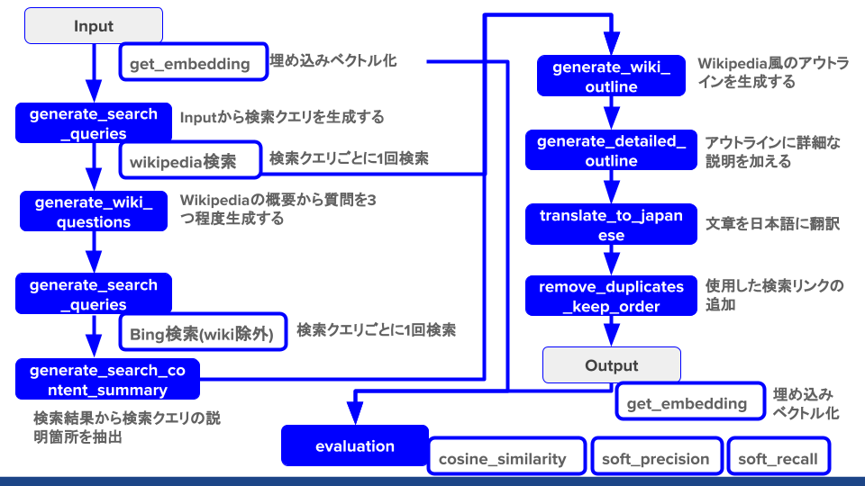

# WikiLikeSearchLLMAgent

WikiLikeSearchLLMAgentは、Wikipediaの記事風の調査報告書をWikipedia記事とBing検索、`gpt-3.5-turbo-0125`のLLMモデルを使用して作成するLLMエージェントです。


途中の出力結果は力学グラフで出力します。
評価として`text-embedding-3-small`を使用して入力内容と最終的な報告書の出力結果を埋め込みベクトル化して`cosine similarity`, `Soft Precision`, `Soft Recall`を算出しています


---

WikiLikeSearchLLMAgent is an LLM agent designed to create research reports in the style of Wikipedia articles, utilizing data from Wikipedia entries, Bing searches, and the `gpt-3.5-turbo-0125` LLM model.


The intermediate outputs are visualized using dynamic graphs. For evaluation, the project employs the `text-embedding-3-small` model to vectorize both the input data and the final report outputs, calculating metrics such as cosine similarity, Soft Precision, and Soft Recall to assess the quality and relevance of the generated content.

---

## 主な機能

- 応答の生成: app.py では、入力した調査報告書を作成したい内容について検索クエリを作成。その内容をWikipediaで検索し、概要を取得。概要から質問を3つ程度作成。
作成した質問に対して検索クエリを作り、Bing検索します。
Wikipediaの検索、Bing検索の結果を使用してWikipedia記事風のアウトラインを作成、アウトラインを説明するテキストを追加作成して日本語に翻訳したものを最終的な調査報告書として出力します。
- グラフによるインタラクションの可視化: 入力されたメッセージと最終的な出力以外の途中の生成結果は力学グラフで出力します。

## 参考内容

- [Graph Chain-of-Thought: Augmenting Large Language Models by Reasoning on Graphs](https://arxiv.org/abs/2404.07103)
- [Assisting in Writing Wikipedia-like Articles From Scratch with Large Language Models](https://arxiv.org/abs/2402.14207)
- [Soft precision and recall](https://www.sciencedirect.com/science/article/pii/S0167865523000296)

---

## Key Features

- Generating Responses: In app.py, a search query is crafted based on the input about the desired research report content. This content is searched on Wikipedia to gather summaries and from these summaries, about three questions are generated. These questions are then used to formulate search queries for Bing. Using the results from both Wikipedia and Bing searches, a Wikipedia-style article outline is created, and additional explanatory text is added. This content is then translated into Japanese to produce the final research report.
- Visualization of Interactions through Graphs: The intermediate outputs, apart from the initial input message and the final output, are visualized using dynamic graphs.

---

## Agent構成
## Agent Configuration



---

## 動作例
## Examples of Operation

```
Input: ディアドコイ戦争や後継者戦争とも言われるディアドコイ戦争について教えてください
```

- 1. generate_search_queries: Inputから検索クエリを生成する
```
検索クエリ: Diadochi Wars explanation
```

- 1.1 検索クエリに対して1回のwikipedia検索の実施

```
検索結果タイトル: Wars of the Diadochi
URL: https://en.wikipedia.org/wiki/Wars_of_the_Diadochi
```

- 2. generate_wiki_questions: Wikipediaの概要から質問を3つ程度生成する
- 3. generate_search_queries: 質問ごとに検索クエリを生成する
- 3-1. Bing検索(wiki除外): 検索クエリごとに1回検索を行う
```
Question 1: What were the primary motivations behind the Wars of the Diadochi among Alexander the Great's generals?
Search 1: Alexander the Great's diadochi (successors) fought over a vast empire spanning from Greece to India in a series of bloody conflicts. Mar 26, 2021 • By Antonis Chaliakopoulos, MSc Museum Studies, BA History & Archaeology. The age of the diadochi of Alexander the Great was one of the bloodiest pages of Greek history.

Question 2: How did the Wars of the Diadochi impact the territories formerly controlled by Alexander the Great?
Search 2: Athens and Aetolia, upon hearing of the death of the king, rebelled, initiating the Lamian War (323 – 322 BCE). It took the intervention of Antipater and Craterus to force an end to it at the Battle at Crannon when the Athenian commander Leosthenes was killed. Of course, Alexander did not live to fulfill his dreams.

Question 3: Can you elaborate on the key events and significant battles that took place during the Wars of the Diadochi?
Search 3: Athens and Aetolia, upon hearing of the death of the king, rebelled, initiating the Lamian War (323 – 322 BCE). It took the intervention of Antipater and Craterus to force an end to it at the Battle at Crannon when the Athenian commander Leosthenes was killed. Of course, Alexander did not live to fulfill his dreams.
```

- 4. generate_wiki_outline: Wikipedia風のアウトラインを生成する

```
# Wars of the Diadochi

## Introduction
- Definition of the Wars of the Diadochi
- Overview of the conflicts
- Timeframe: 322-281 BC

## Background
- Brief history of Alexander the Great's conquests
- Explanation of the Diadochi and their roles as Alexander's successors

## Causes of the Wars
- Ambitions of the Diadochi
- Disputes over the division of Alexander's empire
- Power struggles and rivalries among the generals

## Major Battles and Conflicts
- Lamian War (323-322 BC)
- Battle of Crannon
- Other significant battles and conflicts during the Wars of the Diadochi

## Key Figures
- Alexander the Great
- Diadochi generals (e.g., Antipater, Craterus, Ptolemy, Seleucus, Antigonus)
- Notable military leaders and commanders

## Consequences
- Division of Alexander's empire among the Diadochi
- Establishment of Hellenistic kingdoms
- Legacy of the Wars of the Diadochi in shaping the ancient world

## Impact on Regions
- Effects on Greece, Asia Minor, Egypt, and other regions
- Cultural and political changes resulting from the conflicts

## Historiography
- Ancient and modern sources on the Wars of the Diadochi
- Interpretations and analyses of the events by historians and scholars

## References
- Citations to primary and secondary sources supporting the information presented on the page

## See Also
- Related topics such as Alexander the Great, Hellenistic period, Ancient Greek warfare

## External Links
- Links to relevant articles, resources, and further reading materials about the Wars of the Diadochi
```

- 5. generate_detailed_outline: アウトラインに詳細な説明を加える

```
# Wars of the Diadochi

## Introduction
The Wars of the Diadochi refer to the series of conflicts fought among the generals of Alexander the Great, known as the Diadochi or Successors, following the death of the legendary conqueror in 323 BC. These power struggles aimed to determine who would succeed Alexander in ruling over his vast empire that stretched from Greece to India. The period of these wars lasted from 322 to 281 BC and marked a turbulent era in ancient history as the Diadochi vied for control and dominance.

## Background
Alexander the Great, one of history's most renowned military commanders, had established a vast empire through his conquests that spanned across significant regions of the ancient world, including Greece, Egypt, Persia, and parts of the Indian subcontinent. Upon his untimely death in Babylon in 323 BC, his empire faced fragmentation, leading to a power struggle among his generals, the Diadochi, who sought to claim territories and power for themselves. The term "Diadochi" comes from the Greek word meaning "successors," reflecting their roles as contenders for Alexander's legacy.

## Causes of the Wars
The Wars of the Diadochi were primarily fueled by the ambitions and rivalries among the Diadochi generals. Disputes over the division of Alexander's extensive empire, disagreements on rightful succession, and conflicting interests in securing power and territories led to a series of confrontations and battles. The ambitions of key figures such as Antipater, Craterus, Ptolemy, Seleucus, and Antigonus drove the conflicts as each sought to expand their influence and establish their authority.

## Major Battles and Conflicts
### Lamian War (323-322 BC)
The Lamian War, triggered by the rebellions of Athens and Aetolia following Alexander's death, marked the beginning of the Wars of the Diadochi. This conflict, named after the town of Lamia in central Greece, saw the intervention of generals Antipater and Craterus to suppress the rebellions. The decisive Battle of Crannon in 322 BC resulted in the defeat of the Athenians and the death of their commander Leosthenes, consolidating the authority of the Diadochi.

### Battle of Crannon
The Battle of Crannon in 322 BC was a crucial engagement during the Lamian War. The forces led by Antipater and Craterus clashed with the rebellious Athenians and their allies, resulting in a significant victory for the Diadochi. The defeat of the rebels at Crannon solidified the control of the Diadochi over Greece and marked a turning point in the early phase of the Wars of the Diadochi.

## Key Figures
### Alexander the Great
Alexander the Great, the famed Macedonian king and conqueror, played a pivotal role in shaping the ancient world through his military campaigns and empire-building. His untimely death at a young age led to the power struggles among his generals, setting the stage for the Wars of the Diadochi.

### Diadochi Generals
The Diadochi generals, including figures like Antipater, Craterus, Ptolemy, Seleucus, and Antigonus, were key players in the conflicts that ensued after Alexander's death. Each general commanded significant territories and armies, contributing to the complex dynamics of the power struggles and territorial disputes during the Wars of the Diadochi.

## Consequences
The Wars of the Diadochi resulted in the division of Alexander's empire among the competing generals, leading to the establishment of several Hellenistic kingdoms that would shape the political landscape of the ancient world for centuries to come. The conflicts and power shifts during this period had a lasting impact on the regions involved, influencing cultural, political, and military developments in the aftermath of Alexander's reign.

## Impact on Regions
The Wars of the Diadochi had profound effects on regions such as Greece, Asia Minor, Egypt, and the Near East. The struggles for power and control reshaped the political map of these territories, leading to the rise of new kingdoms and dynasties that would dominate the Hellenistic era. The cultural exchanges and transformations that occurred as a result of these conflicts left a lasting imprint on the societies and civilizations of the time.

## Historiography
Ancient and modern sources provide valuable insights into the Wars of the Diadochi, offering different perspectives on the events and key figures involved. Historians and scholars have studied these conflicts extensively, analyzing the motivations of the Diadochi, the military strategies employed, and the broader implications of the power struggles for the ancient world. Their interpretations and analyses contribute to our understanding of this turbulent period in history.

## References
For further reading and in-depth research on the Wars of the Diadochi, refer to primary sources from ancient historians such as Plutarch, Diodorus Siculus, and Arrian, as well as modern scholarly works by renowned historians specializing in ancient warfare and the Hellenistic period.

## See Also
Explore related topics such as Alexander the Great, the Hellenistic period, and Ancient Greek warfare to gain a comprehensive understanding of the context and significance of the Wars of the Diadochi within the broader historical narrative of the ancient world.

## External Links
For additional resources and articles on the Wars of the Diadochi, consider exploring online archives, academic journals, and museum exhibitions dedicated to ancient history and military conflicts of the Hellenistic era.
```

- 6. translate_to_japanese: アウトラインにを日本語に翻訳

```
# ディアドコイの戦争

## 導入
ディアドコイの戦争は、伝説的な征服者アレクサンダー大王の死後、323年に発生したアレクサンダー大王の将軍たち（ディアドコイまたは後継者として知られている）の間で戦われた一連の紛争を指します。これらの権力闘争は、ギリシャからインドにまで広がる彼の膨大な帝国を誰が継承するかを決定することを目的としていました。これらの戦争の期間は紀元前322年から紀元前281年まで続き、ディアドコイたちが支配と優位を争った古代史の波乱の時代を標示しました。

## 背景
史上最も有名な軍事指導者の一人であるアレクサンダー大王は、ギリシャ、エジプト、ペルシャ、およびインド亜大陸の一部を含む古代世界の重要な地域にまたがる広大な帝国を征服して確立しました。しかし、彼の突然の死が323年のバビロンで起きると、彼の帝国は分裂し、彼の将軍たちであるディアドコイの間で権力闘争が勃発し、彼らは自らのために領土と権力を主張しました。「ディアドコイ」という言葉は、後継者を意味するギリシャ語に由来し、彼らがアレクサンダーの遺産を巡る競争者としての役割を反映しています。

## 戦争の原因
ディアドコイの戦争の原因は、主にディアドコイ将軍たちの野心と対立から生じました。アレクサンダーの広大な帝国の分割に関する紛争、正当な後継者に関する意見の相違、権力と領土を確保するための相反する利害関係が一連の対立と戦闘につながりました。アンティパトロス、クラテロス、プトレマイオス、セレウコス、アンティゴノスなどの主要人物の野心が、各自が影響力を拡大し、権威を確立しようとする中で紛争を推進しました。

## 主要な戦闘と紛争
### ラミア戦争（紀元前323-322年）
アレクサンダーの死後、アテネとアエトリアの反乱が引き金となったラミア戦争は、ディアドコイの戦争の始まりを示しました。この紛争は、ギリシャ中部のラミアという町にちなんで名付けられ、将軍アンティパトロスとクラテロスが介入して反乱を鎮圧しました。紀元前322年のクラノンの戦いでの決定的な勝利は、アテネ人の敗北とその司令官レオステネスの死をもたらし、ディアドコイの権威を強固なものにしました。

### クラノンの戦い
紀元前322年のクラノンの戦いは、ラミア戦争中の重要な戦闘でした。アンティパトロスとクラテロス率いる部隊が反乱を起こしたアテネ人とその同盟者と衝突し、ディアドコイにとって重大な勝利となりました。クラノンでの反乱軍の敗北は、ディアドコイがギリシャを支配し、ディアドコイの戦争初期の転換点となりました。

## 主要人物
### アレクサンダー大王
アレクサンダー大王は、名高いマケドニア王兼征服者であり、軍事遠征と帝国構築を通じて古代世界を形作る上で重要な役割を果たしました。彼の若くしての死は、彼の将軍たちの間での権力闘争を引き起こし、ディアドコイの戦争の舞台を設定しました。

### ディアドコイ将軍
アレクサンダーの死後に続いた紛争での主要な役割を果たしたディアドコイ将軍、例えばアンティパトロス、クラテロス、プトレマイオス、セレウコス、アンティゴノスなどの人物は、各自が重要な領土と軍隊を指揮し、ディアドコイの戦争中の権力闘争と領土紛争の複雑なダイナミクスに貢献しました。

## 結果
ディアドコイの戦争は、競合する将軍たちの間でアレクサンダーの帝国が分割され、古代世界の政治的地図を形成するいくつかのヘレニズム王国の設立につながりました。この期間中の紛争と権力移行は、アレクサンダーの統治の結果として、関連する地域に持続的な影響を与え、文化、政治、軍事の発展に影響を及ぼしました。

## 地域への影響
ディアドコイの戦争は、ギリシャ、小アジア、エジプト、近東などの地域に深い影響を与えました。権力と支配権を巡る争いがこれらの地域の政治地図を再編し、ヘレニズム時代を支配する新たな王国や王朝の台頭をもたらしました。これらの紛争によって生じた文化的交流と変容は、当時の社会と文明に永続的な足跡を残しました。

## 史学
古代および現代の資料は、ディアドコイの戦争に関する貴重な洞察を提供し、関連する出来事や主要人物について異なる視点を示しています。歴史家や学者たちは、ディアドコイの動機、使用された軍事戦略、および古代世界に対する権力闘争の広範な影響を分析し、これらの紛争を詳細に研究しています。彼らの解釈と分析は、歴史のこの波乱の時期を理解する上で貢献しています。

## 参考文献
ディアドコイの戦争に関するさらなる読書や深い研究には、プルタルコス、ディオドロス・シクルス、アリアンなどの古代歴史家による原典を参照するとともに、古代戦争とヘレニズム時代に特化した著名な歴史家による現代の学術著作を検討してください。

## 関連項目
アレクサンダー大王、ヘレニズム時代、古代ギリシャの戦争など、関連するトピックを探求することで、ディアドコイの戦争の広い歴史的物語の文脈と重要性を包括的に理解することができます。

## 外部リンク
ディアドコイの戦争に関する追加リソースや記事を探す際には、古代史やヘレニズム時代の軍事紛争に特化したオンラインアーカイブ、学術誌、博物館展示を探索することを検討してください。
```

- 7. 入力と出力の埋め込みベクトル化
- 8. 評価
	- cosine_similarity: `0.5700739091639646`
	- soft_precision: `0.5700739091639646`
	- soft_recall: `0.5700739091639646`


---

## アクセスポイント

- フロントエンド: ユーザーインターフェースは http://localhost:3000 でアクセス可能です。ここからユーザーはメッセージを送信し、グラフの可視化を見ることができます。
- バックエンド: サーバーは http://localhost:5000 で稼働しており、フロントエンドからのリクエストを処理します。具体的には、http://localhost:5000/chat にPOSTリクエストを送ることで、ユーザーからのメッセージが処理され、応答が返されます。

---

## Access Points

- Frontend: The user interface is accessible at http://localhost:3000, where users can send messages and view the graphical visualization of the interactions.
- Backend: The server operates at http://localhost:5000, handling requests from the frontend. Specifically, POST requests sent to http://localhost:5000/chat process user messages and return responses.

---

## 動作イメージ
## Functional Image


- ファイル構成は以下です
- File Structure

```
WikiLikeSearchLLMAgent/
│  docker-compose.yml
│  Dockerfile
│  package.json
│  README.md
│
├─backend
│      .env
│      .prettierrc
│      app.py
│      Dockerfile
│      requirements.txt
│
└─frontend
    │  config-overrides.js
    │  Dockerfile
    │  package.json
    │  tsconfig.json
    │
    ├─public
    │      index.html
    │
    └─src
            App.css
            App.tsx
            ForceGraph.js
            index.css
            index.tsx
```

.envには、OPENAI_API_KEYとBING_API_KEYをそれぞれ設定してください

Please ensure the following keys are set in your .env file:

```
OPENAI_API_KEY=****
BING_API_KEY=****
```
